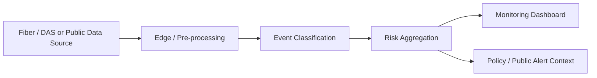

# Submarine Cable Resilience Monitor

An **independent, software-only reimplementation** for visualizing submarine-cable monitoring concepts, network resilience, synthetic risk events, and public-tech communication.

> **Status:** Prototype / simulation. This repository does **not** connect to a live telecom operator network, DAS interrogator, or emergency-warning authority.

## Why this project exists

Submarine cables are critical infrastructure, but the operational concepts behind cable monitoring and resilience can be difficult to communicate outside specialist teams. This project turns those concepts into a reproducible dashboard that can be used for public-tech discussion, research prototyping, civic-tech collaboration, and future integration with authorized data sources.

## Current capabilities

- Synthetic multi-segment cable monitoring view
- Normal / watch / critical states
- Simulated event stream and confidence values
- Resilience score visualization
- Concept pipeline from sensing source to dashboard
- Explicit limitations and non-production disclaimer
- Static deployment: GitHub Pages / Netlify / Vercel compatible

## Architecture



The current repository runs in **simulation mode**. Future versions can add validated public datasets or authorized sensor APIs without changing the public dashboard concept.

## Run locally

No build step is required.

```bash
python -m http.server 8000
```

Then open `http://localhost:8000`.

## Data

`data/demo-events.json` contains synthetic demonstration records only. Do not interpret them as real cable events.

## Scope and limitations

- No physical DAS hardware or ESP32 firmware is included.
- No live carrier / landing-station integration is claimed.
- No emergency-warning or life-safety use is intended.
- All demo event records are synthetic unless a future source is explicitly documented.

## Project context

This repository is a fresh independent software implementation. It is intended to consolidate prior learning and public communication around Internet infrastructure, submarine-cable resilience, and network monitoring into a reproducible open project.

## Roadmap

- [ ] Add documented public datasets
- [ ] Add geospatial cable-layer support
- [ ] Add event replay and scenario comparison
- [ ] Add configurable resilience indicators
- [ ] Add multilingual public-information mode
- [ ] Add exportable incident report
- [ ] Add optional API adapter interface for authorized sensor data

## License

MIT License. See `LICENSE`.
